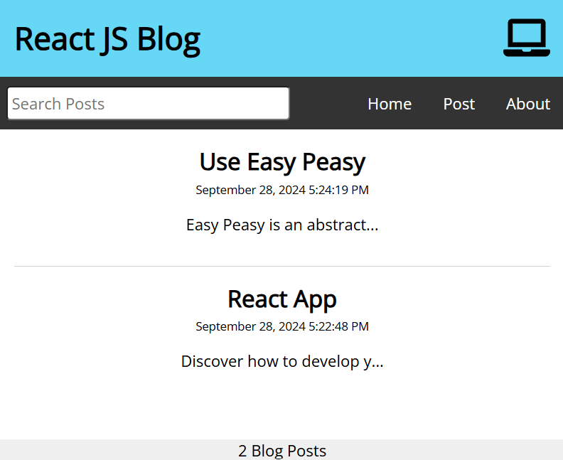

# blog-react

🚀This application is a blog developed in react, using Easy Peasy (Redux abstraction), axios, react router and json server 

In the project directory, you can run:

### `npm start`
### `npx json-server -p 3500 -w data/db.json`

